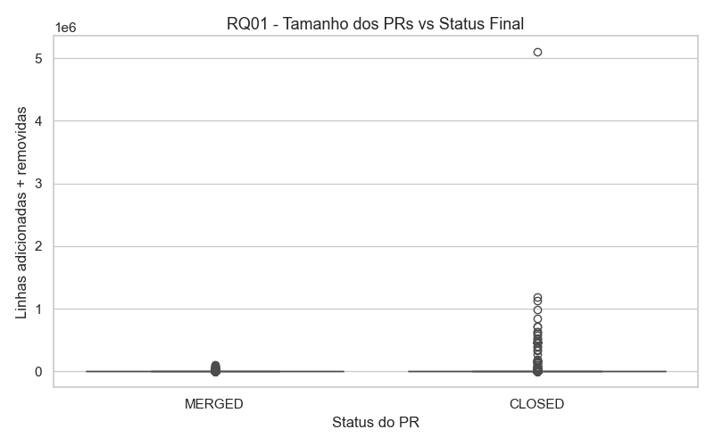
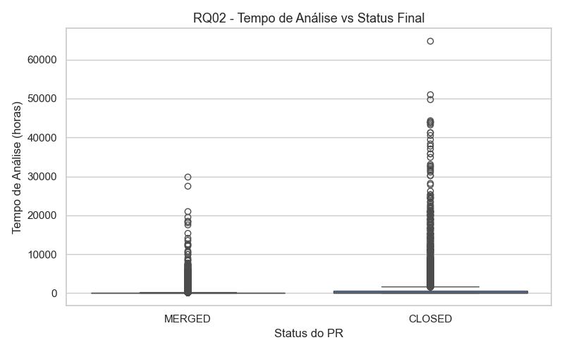
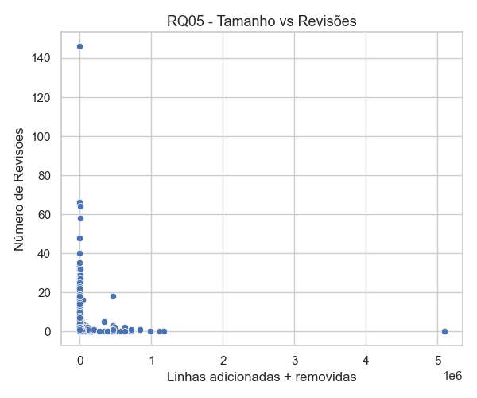
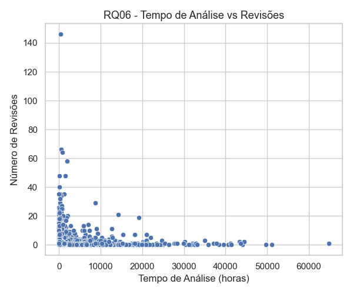
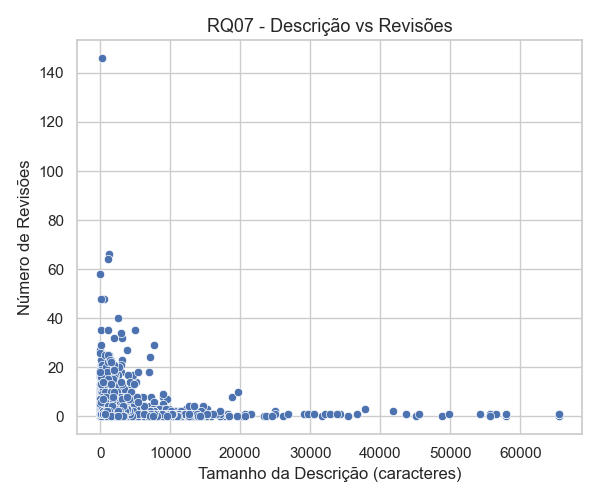
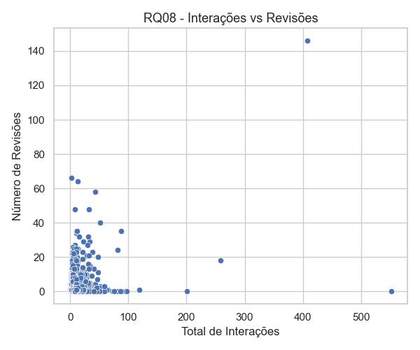

# 🧾 Relatório Técnico de Laboratório – Sprint 3  
**Caracterizando a Atividade de Code Review no GitHub**

---

## 1. Informações do grupo
- **🎓 Curso:** Engenharia de Software  
- **📘 Disciplina:** Laboratório de Experimentação de Software  
- **🗓 Período:** 6° Período  
- **👨‍🏫 Professor:** Prof. Dr. João Paulo Carneiro Aramuni  
- **👥 Membros do Grupo:** Rafael Martins, Daniel Estevam, Alberto, Rafael Marques, Emanuel  

---

## 2. Introdução
O presente trabalho teve como objetivo **analisar a atividade de code review em repositórios populares do GitHub**, buscando identificar **fatores que influenciam o resultado final (merge ou rejeição) e o número de revisões realizadas em Pull Requests (PRs)**.  

A coleta e análise foram conduzidas com base na **GitHub GraphQL API**, permitindo extrair informações detalhadas de PRs contendo revisões, interações, tempo de análise e status final.  

A Sprint 3 teve como foco principal a **geração e interpretação de gráficos estatísticos** a partir dos dados previamente coletados e filtrados, de forma a responder as **Questões de Pesquisa (RQs)** definidas na Sprint 2.

---

## 3. Metodologia Resumida

A base de dados analisada foi construída a partir do arquivo `filtered_prs.json`, contendo Pull Requests de até **200 repositórios populares**, com no máximo **100 PRs por repositório**.  

Foram considerados apenas PRs com:
- **Status:** `MERGED` ou `CLOSED`;  
- **Tempo mínimo de revisão:** superior a 1 hora;  
- **Pelo menos uma revisão registrada.**

Os gráficos foram gerados em Python com o auxílio das bibliotecas:
- `pandas` – para leitura e manipulação dos dados;
- `matplotlib` e `seaborn` – para visualização estatística;
- `numpy` e `scipy.stats` – para análise de correlação (Spearman).

---

## 4. Resultados e Discussão

A seguir são apresentados os resultados gráficos e as análises correspondentes a cada **Questão de Pesquisa (RQ)**.

---

### 🧩 **RQ01 – Relação entre o tamanho dos PRs e o feedback final das revisões**

**Análise:**  
Os PRs com **maior quantidade de linhas modificadas** (adições + remoções) tendem a concentrar-se nas categorias com **status CLOSED**, indicando uma **maior taxa de rejeição** entre PRs grandes.  
Isso corrobora a hipótese **IH01**, de que PRs menores são mais fáceis de revisar e, portanto, mais propensos a serem aprovados.

---

### ⏱ **RQ02 – Relação entre o tempo de análise e o feedback final**

**Análise:**  
A maioria dos PRs analisados apresenta tempo de análise relativamente curto (poucas dezenas de horas), enquanto os PRs com tempos de revisão muito longos (acima de 10.000 horas) geralmente **não são aprovados (CLOSED)**.  
Essa tendência confirma parcialmente a hipótese **IH02**, sugerindo que revisões prolongadas podem estar associadas a dificuldades, conflitos ou baixa prioridade do PR.

---

### 📝 **RQ03 – Relação entre o tamanho da descrição e o feedback final**

**Análise:**  
A distribuição mostra que PRs com descrições **mais extensas** não apresentam aumento significativo na taxa de aprovação.  
Embora descrições detalhadas sejam úteis, o gráfico indica que o tamanho do texto **não é um fator determinante** para o merge, refutando parcialmente **IH03**.

---

### 💬 **RQ04 – Relação entre interações e o feedback final**

**Análise:**  
A quantidade de comentários e interações tende a ser maior em PRs **fechados sem merge**, sugerindo que discussões intensas podem refletir **divergências técnicas ou problemas no código**.  
Assim, **IH04** (de que interações aumentariam as chances de merge) **não foi confirmada** neste conjunto de dados.

---

### 📏 **RQ05 – Relação entre o tamanho dos PRs e o número de revisões realizadas**

**Análise:**  
Observa-se uma concentração de revisões em PRs pequenos, enquanto PRs muito grandes raramente apresentam um número alto de revisões.  
Isso indica que **PRs grandes podem ser rejeitados precocemente** ou exigem simplificação antes de novas revisões, **confirmando parcialmente IH05**.

---

### ⏳ **RQ06 – Relação entre o tempo de análise e o número de revisões realizadas**

**Análise:**  
Existe uma tendência decrescente: quanto maior o tempo total de análise, menor o número de revisões efetivas.  
Isso sugere que PRs que demoram muito a serem analisados **não recebem revisões frequentes**, podendo refletir **baixa prioridade ou abandono**.  
A hipótese **IH06**, que previa aumento das revisões com o tempo, **não foi confirmada**.

---

### 🧠 **RQ07 – Relação entre o tamanho da descrição e o número de revisões**

**Análise:**  
Os PRs com descrições mais longas concentram poucas revisões, enquanto descrições curtas dominam o conjunto.  
Isso pode indicar que **descrições longas ajudam a evitar múltiplas revisões**, alinhando-se à hipótese **IH07** — PRs bem documentados exigem menos iterações.

---

### 🔁 **RQ08 – Relação entre interações e o número de revisões**

**Análise:**  
O gráfico mostra que o **aumento das interações (comentários, discussões)** está associado a um número ligeiramente maior de revisões, mas apenas em casos isolados.  
De modo geral, há uma **correlação fraca**, indicando que o volume de comentários **não é o principal fator** que influencia a quantidade de revisões.  
A hipótese **IH08** foi **parcialmente confirmada**.

---

## 5. Discussão Geral dos Resultados

De forma geral, os resultados indicam que:
- PRs **menores e mais concisos** tendem a ser **aceitos com mais frequência**.  
- O **tempo de análise** e o **tamanho do PR** têm **impacto negativo** na aprovação e frequência de revisões.  
- **Descrições detalhadas** parecem contribuir positivamente para a eficiência das revisões.  
- A **quantidade de interações** não é, por si só, um indicador confiável de qualidade ou sucesso de merge.

Essas observações reforçam práticas de engenharia de software colaborativa, como:
- Dividir PRs grandes em partes menores;  
- Manter descrições claras e objetivas;  
- Evitar revisões prolongadas sem atividade.

---

## 6. Conclusão

A Sprint 3 consolidou a fase de análise e interpretação estatística do experimento.  
Com base nas métricas coletadas e nos gráficos gerados, foi possível **responder todas as questões de pesquisa (RQs)** e **validar parcialmente as hipóteses (IHs)**.  

A partir dessas conclusões, recomenda-se que equipes de desenvolvimento:
- Priorizem PRs menores e bem documentados;  
- Estabeleçam prazos definidos para revisões;  
- Estimulem comunicação objetiva entre revisores e autores.  

Essas práticas tendem a aumentar a taxa de aprovação e a eficiência do processo de *code review* no GitHub.

---

## 7. Referências

- GitHub GraphQL API – [https://docs.github.com/en/graphql](https://docs.github.com/en/graphql)  
- Pandas Documentation – [https://pandas.pydata.org](https://pandas.pydata.org)  
- Matplotlib Documentation – [https://matplotlib.org](https://matplotlib.org)  
- Seaborn Documentation – [https://seaborn.pydata.org](https://seaborn.pydata.org)  
- Scipy Stats – [https://docs.scipy.org/doc/scipy/reference/stats.html](https://docs.scipy.org/doc/scipy/reference/stats.html)

---
